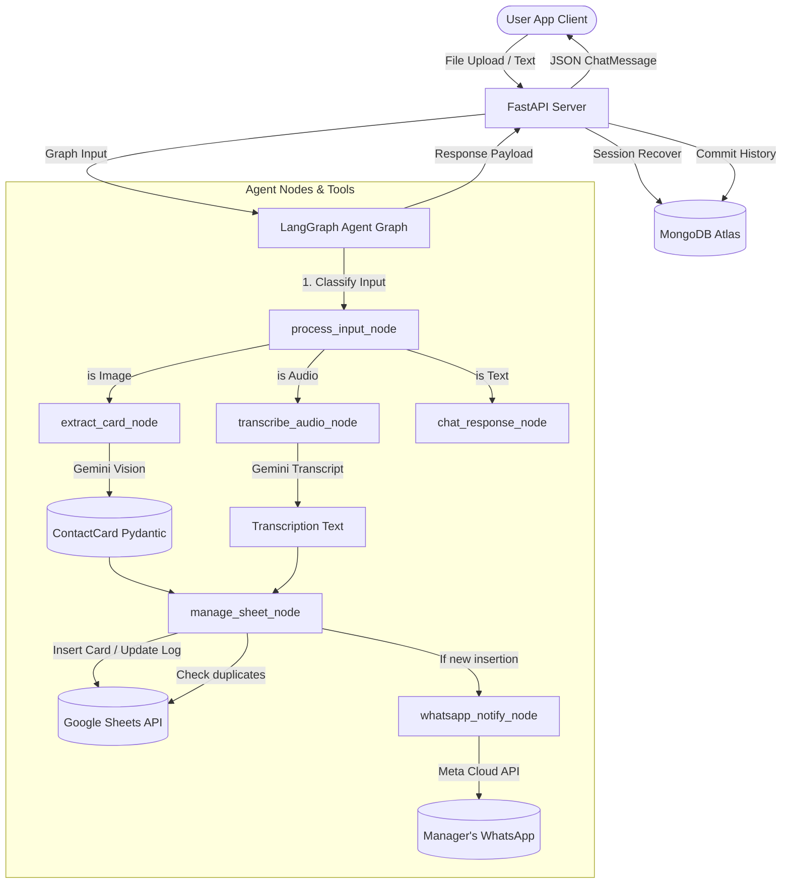

# Visiting Card Digitization & Voice Notes Orchestrator

An intelligent, AI-powered system designed to streamline contact collection at conferences and business events. The application allows users to digitize business cards via OCR, automatically verify and save contact details to a Google Sheet database, track active conversation sessions, and append spoken transcriptions as timestamped logs.

---

## 1. Architecture Overview

The system uses a single compiled **LangGraph Agent Orchestrator** to handle input classification, extraction validation, database persistence, and external notifications.



---

## 2. Features

*   **⚡ AI Visiting Card OCR**: Dynamically extracts names, email addresses, phone numbers, and company labels from card images using Gemini 2.5 Flash, validated by Pydantic.
*   **🎙️ Voice Note Transcription**: Converts spoken audio notes into written transcripts using Gemini's audio parsing and appends them to the active contact row.
*   **📊 Google Sheets Synchronization**: Automates database entries. Prevents duplication by checking emails and phone numbers before writing.
*   **🔔 Meta WhatsApp Alerts**: Dispatches formatted messages (name, company, email, phone, UUID) to the manager's phone.
*   **💾 Decoupled Session Memory**: Persists conversation logs and session trackers in MongoDB. Automatically falls back to **in-memory mock storage** if MongoDB Atlas is disconnected.
*   **✨ Glassmorphic Dark UI**: A responsive interface built with React Vite, featuring background animations, drag-and-drop uploader overlays, and custom scrollbars.

---

## 3. Tech Stack

### Frontend
*   **Core**: React (v18.3), Vite (v5.3)
*   **Styling**: Pure CSS (Glassmorphism design tokens)
*   **Icons**: Lucide React

### Backend
*   **API Framework**: FastAPI (Uvicorn server)
*   **Agent framework**: LangGraph, LangChain Core
*   **Generative AI**: Google GenAI SDK (`gemini-2.5-flash`)
*   **Databases**: MongoDB (async Motor driver) & Google Sheets API

---

## 4. Folder Structure

```text
krid/
├── backend/
│   ├── app/
│   │   ├── api/
│   │   │   ├── chat.py             # Message & upload multipart routers
│   │   │   └── sessions.py         # Session management endpoint actions
│   │   ├── database/
│   │   │   └── mongo.py            # Client manager & async CRUD with fallback
│   │   ├── models/
│   │   │   └── contact.py          # Pydantic schemas (ContactCard, ExtractedContact)
│   │   │   └── chat.py             # Stored session history schemas
│   │   ├── services/
│   │   │   ├── sheets.py           # Google sheets sync & row appenders
│   │   │   ├── whatsapp.py         # Meta Cloud API message client
│   │   │   ├── vision.py           # Gemini vision card parser
│   │   │   └── speech.py           # Gemini voice transcriber
│   │   ├── agent/
│   │   │   ├── graph.py            # Compiled LangGraph workflow logic
│   │   │   └── state.py            # Unified TypedDict Graph state
│   │   ├── config.py               # Env settings loaders
│   │   └── main.py                 # FastAPI application root & health checker
│   ├── tests/
│   │   ├── test_vision.py          # Vision extraction OCR test cases
│   │   ├── test_speech.py          # Audio note transcriber test cases
│   │   ├── test_whatsapp.py        # WhatsApp delivery verification tests
│   │   └── test_agent_integration.py # End-to-end TestClient integration tests
│   ├── Dockerfile
│   └── requirements.txt
├── frontend/
│   ├── src/
│   │   ├── components/
│   │   │   ├── SessionSidebar.jsx  # Active session catalog sidebar
│   │   │   ├── ChatWindow.jsx      # Message logs & metadata contact card visualizer
│   │   │   └── Uploader.jsx        # Drag-and-drop file upload dialog
│   │   ├── App.jsx                 # React main application state manager
│   │   ├── index.css               # Styling layout (dark mode glassmorphic tokens)
│   │   ├── main.jsx                # DOM root mount script
│   │   └── config.js               # API URL exports
│   ├── index.html
│   ├── vite.config.js
│   └── package.json
└── .env                            # Root environment parameters
```

---

## 5. Installation & Setup

### Prerequisites
*   Python 3.10+
*   Node.js 18+

### Environment Configuration
Create a `.env` file in the root project directory:

```env
# Backend Server
PORT=8001
ENVIRONMENT=development

# Gemini API Key
GEMINI_API_KEY=your-gemini-api-key

# MongoDB Database Configuration
MONGODB_URI=mongodb+srv://<user>:<password>@cluster.mongodb.net/krid_db
MONGODB_DB_NAME=krid_db

# Google Sheets Configuration
GOOGLE_SHEETS_ID=your-google-sheets-id
GOOGLE_APPLICATION_CREDENTIALS=backend/service-account.json

# Meta WhatsApp Cloud API
WHATSAPP_ACCESS_TOKEN=your-meta-access-token
WHATSAPP_PHONE_NUMBER_ID=your-phone-number-id
WHATSAPP_MANAGER_PHONE=recipient-phone-number
```

### Backend Setup
1. Navigate to the backend directory and set up a virtual environment:
   ```bash
   cd backend
   python -m venv .venv
   .venv\Scripts\activate  # On Windows
   source .venv/bin/activate  # On macOS/Linux
   ```
2. Install dependencies:
   ```bash
   pip install -r requirements.txt
   ```
3. Run the development server:
   ```bash
   uvicorn app.main:app --host 127.0.0.1 --port 8001 --reload
   ```

### Frontend Setup
1. Navigate to the frontend directory:
   ```bash
   cd ../frontend
   ```
2. Install packages:
   ```bash
   npm install
   ```
3. Launch the development server:
   ```bash
   npm run dev
   ```
   Open `http://localhost:5173` in your browser.

---

## 6. Running Tests

Execute test suites from the `backend/` directory:

```bash
# Run service tests (Vision, Speech, WhatsApp)
.venv\Scripts\python -m unittest tests/test_vision.py
.venv\Scripts\python -m unittest tests/test_speech.py
.venv\Scripts\python -m unittest tests/test_whatsapp.py

# Run end-to-end integration tests
.venv\Scripts\python -m unittest tests/test_agent_integration.py
```

---

## 7. API Reference Summary

Interactive OpenAPI documentation is available locally at:
*   **Swagger UI**: `http://localhost:8001/docs`
*   **ReDoc**: `http://localhost:8001/redoc`

| HTTP Method | Path | Description |
|---|---|---|
| **GET** | `/health` | Verify database & API service connectivity status |
| **POST** | `/api/sessions` | Create a new session ID |
| **GET** | `/api/sessions` | Retrieve all active sessions list |
| **DELETE** | `/api/sessions/{session_id}` | Remove a session and its message logs |
| **GET** | `/api/sessions/{session_id}/messages` | Fetch chronological message history list |
| **POST** | `/api/chat/message` | Send text query to the LangGraph agent |
| **POST** | `/api/chat/upload` | Upload image card (OCR) or audio voice note (transcribe) |

---

## 8. Future Improvements

*   **☁️ Cloud File Storage**: Integrate Google Cloud Storage or AWS S3 to persist raw uploaded images and audio file attachments.
*   **🎙️ Multi-lingual transcription**: Support real-time translation of speech transcripts into the target database language.
*   **👤 Manual Corrections Flow**: Expose editable text forms in the frontend when OCR fails or needs adjustment, updating rows via matching UUIDs.
