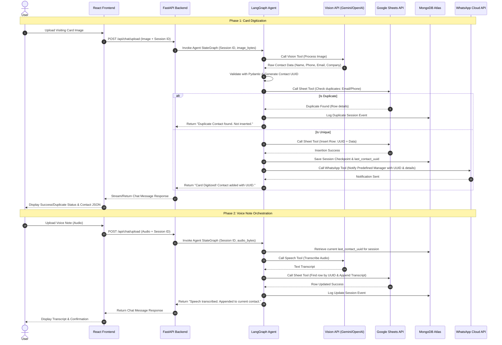
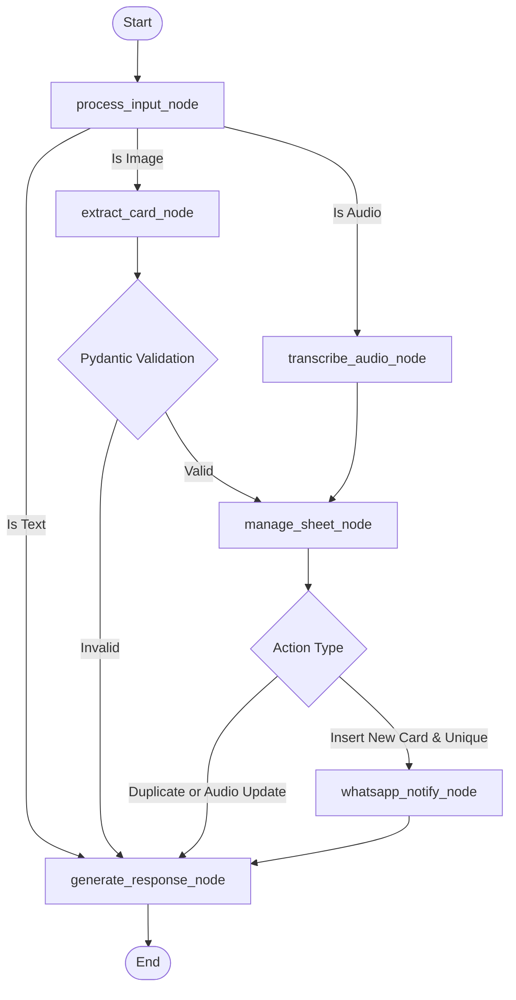
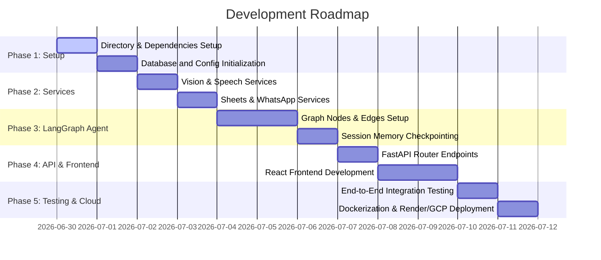

# Visiting Card Digitization and Voice Notes Orchestrator - Implementation Plan

This plan details the design decisions, schemas, and workflows, updated to include contact UUIDs, Pydantic validation, and MongoDB session tracking.

---

# Step 1: Complete Architecture Explanation (Updated)

- **Frontend**: Single-page React application with a dynamic glassmorphic chat interface, session sidebar, and media uploader.
- **Backend API**: FastAPI serving routes for chat/upload and sessions.
- **Agent Orchestrator**: LangGraph agent executing tools for Vision, Sheets, Speech, and WhatsApp.
- **Primary Database**: Google Sheets (stores contact info including a unique UUID, name, email, phone, company, voice transcripts, and timestamps).
- **Session Database**: MongoDB Atlas (stores session history, conversation states, checkpoints, and maps the active session to the current contact UUID).
- **Validation**: Pydantic models validate extracted JSON data from the Vision model.

---

# Step 2: System Workflow



---

# Step 3: LangGraph Workflow



### Graph State Definition
```python
from typing import TypedDict, List, Optional
from langchain_core.messages import BaseMessage

class AgentState(TypedDict):
    messages: List[BaseMessage]
    session_id: str
    last_contact_uuid: Optional[str]
    extracted_contact: Optional[dict]  # Temp holder for pydantic data
    transcription: Optional[str]        # Temp holder for transcript
    status: Optional[str]               # e.g., 'extracted', 'duplicate', 'inserted', 'updated', 'failed'
    error_message: Optional[str]
```

---

# Step 4: MongoDB Schema Design

We will maintain two main collections:
1. `chat_sessions`:
   ```json
   {
     "_id": "session_id_uuid_or_string",
     "last_contact_uuid": "contact-uuid-string-or-null",
     "created_at": "ISODate",
     "updated_at": "ISODate"
   }
   ```
2. `chat_histories` (For rendering messages in the React frontend):
   ```json
   {
     "_id": "history_id_uuid",
     "session_id": "session_id_uuid_or_string",
     "messages": [
       {
         "sender": "user" | "assistant",
         "text": "Message content",
         "timestamp": "ISODate",
         "type": "text" | "image" | "audio",
         "media_url": "optional_local_or_cloud_storage_path",
         "metadata": {
           "extracted_contact": {},
           "uuid": "contact_uuid_if_any",
           "status": "duplicate" | "inserted" | "updated"
         }
       }
     ]
   }
   ```
3. `checkpoints` (Used internally by LangGraph's MongoDBSaver to maintain checkpoint states).

---

# Step 5: Google Sheet Format Design

The Sheets database will use a fixed column schema. The backend will parse/write values by matching column headers.

| Column Letter | Column Header | Data Type | Description |
|---|---|---|---|
| **A** | `UUID` | String | Unique UUID for the contact |
| **B** | `Name` | String | Extracted Full Name |
| **C** | `Phone` | String | Cleaned Phone Number (with country code) |
| **D** | `Email` | String | Validated Email Address |
| **E** | `Company` | String | Extracted Company Name |
| **F** | `Voice Notes` | String | Appended speech transcripts |
| **G** | `Created At` | Timestamp | Date and time contact was added |
| **H** | `Updated At` | Timestamp | Date and time of last modification |

---

# Step 6: Folder Structure Design

```
krid/
├── backend/
│   ├── app/
│   │   ├── __init__.py
│   │   ├── main.py
│   │   ├── config.py
│   │   ├── api/
│   │   │   ├── __init__.py
│   │   │   ├── chat.py
│   │   │   └── sessions.py
│   │   ├── database/
│   │   │   ├── __init__.py
│   │   │   └── mongo.py
│   │   ├── models/
│   │   │   ├── __init__.py
│   │   │   └── contact.py
│   │   ├── services/
│   │   │   ├── __init__.py
│   │   │   ├── sheets.py
│   │   │   ├── whatsapp.py
│   │   │   ├── vision.py
│   │   │   └── speech.py
│   │   ├── agent/
│   │   │   ├── __init__.py
│   │   │   ├── graph.py
│   │   │   ├── state.py
│   │   │   └── tools.py
│   │   └── utils/
│   │       ├── __init__.py
│   │       └── helpers.py
│   ├── requirements.txt
│   ├── Dockerfile
│   └── .env.example
├── frontend/
│   ├── public/
│   ├── src/
│   │   ├── assets/
│   │   ├── components/
│   │   │   ├── ChatWindow.jsx
│   │   │   ├── SessionSidebar.jsx
│   │   │   ├── Uploader.jsx
│   │   │   └── MessageItem.jsx
│   │   ├── App.jsx
│   │   ├── index.css
│   │   ├── main.jsx
│   │   └── config.js
│   ├── package.json
│   ├── vite.config.js
│   └── .env.example
└── README.md
```

---

# Step 7: List of API Endpoints

### 1. Chat & Session Operations
- **`GET /api/sessions`**: Retrieve all active chat sessions.
- **`POST /api/sessions`**: Create a new chat session. Returns `session_id`.
- **`DELETE /api/sessions/{session_id}`**: Delete a chat session and its corresponding messages.
- **`GET /api/sessions/{session_id}/messages`**: Retrieve historical messages for a session.

### 2. Message & Media Handlers
- **`POST /api/chat/message`**: Handle text messages within a session.
- **`POST /api/chat/upload`**: Multipart form endpoint accepting an `image` or `audio` file, plus `session_id`. Initiates the LangGraph Agent execution loop.

---

# Step 8: Explain Every Tool in LangGraph

1. **`extract_business_card_tool`**:
   - **Input**: Image file bytes.
   - **Action**: Sends image to Vision Model, parses response, fits it to the `ContactCard` Pydantic model.
   - **Output**: Pydantic model representation or validation error message.
2. **`transcribe_audio_tool`**:
   - **Input**: Audio file bytes.
   - **Action**: Sends audio to Speech-to-Text Model, transcribes it.
   - **Output**: Clean transcript text.
3. **`check_duplicate_contact_tool`**:
   - **Input**: Email and Phone.
   - **Action**: Queries the Google Sheet, searching for matching values in columns `Email` and `Phone`.
   - **Output**: Boolean (True if found, False otherwise) and details of matching contact.
4. **`insert_contact_tool`**:
   - **Input**: `ContactCard` details and generated UUID.
   - **Action**: Appends a new row to Google Sheets.
   - **Output**: Dictionary confirming write success.
5. **`update_voice_note_tool`**:
   - **Input**: `UUID` and `transcript`.
   - **Action**: Finds row in Sheets with the matching `UUID` and appends the transcript to the `Voice Notes` column, appending timestamp.
   - **Output**: Success status.
6. **`whatsapp_notification_tool`**:
   - **Input**: Contact name, company, UUID, and manager phone number.
   - **Action**: Invokes Meta Graph API to send template or custom message.
   - **Output**: API response payload status.

---

# Step 9: Development Roadmap



---

## Verification Plan

### Automated Tests
- Run backend unit tests using `pytest` for each helper service (Sheets duplicate check, Pydantic validation, WhatsApp mock).
- Test FastAPI routes with `TestClient`.

### Manual Verification
- Upload test business card image -> Verify Google Sheets insertion & WhatsApp alert.
- Upload duplicate business card image -> Verify message warns user and stops duplicate write.
- Upload audio note -> Verify audio transcript is appended to the correct row via its UUID.
- Toggle between multiple chat sessions -> Verify conversation memory persists.
